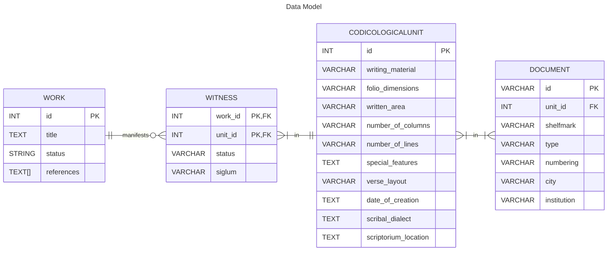

# Scrape metadata from the Handschriftencensus

## Install

1. Create and activate a virtual Python environment (version 3.13+).

2. Install the project.

```
pip install git@github.com:LostMa-ERC/hc-scraper.git
```

### Contributors' installation

1. Create and activate a virtual Python environment (version 3.13+).

2. Download the code with `git clone`.

3. Install an editable (`-e`) version of the project, with its developer dependencies (`.[dev]`), and set-up `pre-commit`.

```
pip install -e .[dev]
pre-commit install
```

## Methodology

### Data model



### _Lancelot_ example

Key: `WP` = Page that describes the work; `CP` = Page that describes the manuscript / codicological unit.

**WORK**

||id (PK)|title|status|references|
|--|--|--|--|--|
||221|'Lancelot'|complete|[DNB](https://portal.dnb.de/opac.htm?query=nid%3D4074015-8&method=simpleSearch&cqlMode=true), [lobid](https://lobid.org/gnd/4074015-8), [g-in](https://www.germanistik-im-netz.de/suchergebnisse/?q=4074015-8)
|_data source_|[`WP`](https://handschriftencensus.de/werke/221)|[`WP`](https://handschriftencensus.de/werke/221)|[`WP`](https://handschriftencensus.de/werke/221)|[`WP`](https://handschriftencensus.de/werke/221)|

**WITNESS**

||work_id (PK)|unit_id (PK)|status|siglum|
|--|--|--|--|--|
||221|4204|codex|p|
|_data source_|[`WP`](https://handschriftencensus.de/werke/221)|[`WP`](https://handschriftencensus.de/werke/221)|[`WP`](https://handschriftencensus.de/werke/221)|[`CP`](https://handschriftencensus.de/4204)|

**CODICOLOGICALUNIT**

||id (PK)|writing_material|folio_dimensions|written_area|number_of_columns|number_of_lines|special_features|verse_layout|date_of_creation|scribal_dialect|scriptorium_location|
|--|--|--|--|--|--|--|--|--|--|--|--|
||4204|Papier|298 x 203 mm und 295 x 205 mm|245-250 x 145 mm|1|36-48|Namenseintrag ([b], Vorsatzblatt): Johan Doringk||2. Viertel 16. Jh. (Zimmermann S. 222, 223)|südrheinfrk. mit mittelfrk. Schreibeigentümlichkeiten (Zimmermann S. 222, 223)|
|_data source_|[`CP`](https://handschriftencensus.de/4204)|[`CP`](https://handschriftencensus.de/4204)|[`CP`](https://handschriftencensus.de/4204)|[`CP`](https://handschriftencensus.de/4204)|[`CP`](https://handschriftencensus.de/4204)|[`CP`](https://handschriftencensus.de/4204)|[`CP`](https://handschriftencensus.de/4204)|[`CP`](https://handschriftencensus.de/4204)|[`CP`](https://handschriftencensus.de/4204)|[`CP`](https://handschriftencensus.de/4204)|[`CP`](https://handschriftencensus.de/4204)|

**DOCUMENT**

||id (PK)|unit_id|shelfmark|type|numbering|city|institution|
|--|--|--|--|--|--|--|--|
||s81107|4204|Cpg 91|Codex|321 Blätter|Heidelberg|Universitätsbibl.|
||s115557|4204|Cpg 92|Codex|198 Blätter|Heidelberg|Universitätsbibl.|
|_data source_|[`CP`](https://handschriftencensus.de/4204)|[`CP`](https://handschriftencensus.de/4204)|[`CP`](https://handschriftencensus.de/4204)|[`CP`](https://handschriftencensus.de/4204)|[`CP`](https://handschriftencensus.de/4204)|[`CP`](https://handschriftencensus.de/4204)|[`CP`](https://handschriftencensus.de/4204)|

## Usage

### Phase 1

Collect works and their witnesses, and create records for all the linked codicological units that will be scraped in phase 2.

```
python src/main.py works
```
