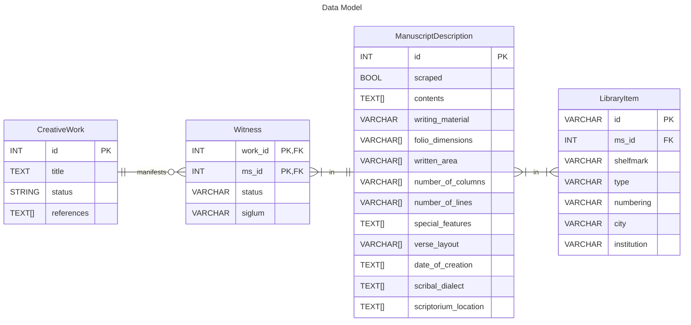

# Scrape metadata from the Handschriftencensus

**TLDR;**

```shell
hsc works # Collect works
hsc manuscripts # Collect works' witnesses / manuscripts
```

## Table of contents

- [Installation](#install)
- [Methodology](#methodology)
- [Usage](#usage)
    - [Phase 1](#phase-1)
    - [Phase 2](#phase-2)

## Install

1. Create and activate a virtual Python environment (version 3.13+).

2. Install the project.

```
pip install git@github.com:LostMa-ERC/hc-scraper.git
```

### Contributors' installation

1. Create and activate a virtual Python environment (version 3.13+).

2. Download the code with `git clone`.

3. Install an editable (`-e`) version of the project, with its developer dependencies (`.[dev]`), and set-up `pre-commit`.

```
pip install -e .[dev]
pre-commit install
```

## Methodology

### Data model



### _Lancelot_ example

Key: `WP` = Page that describes the work; `CP` = Page that describes the manuscript / codicological unit.

**CreativeWork**

||id (PK)|title|status|references|
|--|--|--|--|--|
||221|'Lancelot'|complete|[DNB](https://portal.dnb.de/opac.htm?query=nid%3D4074015-8&method=simpleSearch&cqlMode=true), [lobid](https://lobid.org/gnd/4074015-8), [g-in](https://www.germanistik-im-netz.de/suchergebnisse/?q=4074015-8)
|_data source_|[`WP`](https://handschriftencensus.de/werke/221)|[`WP`](https://handschriftencensus.de/werke/221)|[`WP`](https://handschriftencensus.de/werke/221)|[`WP`](https://handschriftencensus.de/werke/221)|

**Witness**

||work_id (PK)|ms_id (PK)|status|siglum|
|--|--|--|--|--|
||221|4204|codex|p|
|_data source_|[`WP`](https://handschriftencensus.de/werke/221)|[`WP`](https://handschriftencensus.de/werke/221)|[`WP`](https://handschriftencensus.de/werke/221)|[`CP`](https://handschriftencensus.de/4204)|

**ManuscriptDescription**

||id (PK)|writing_material|folio_dimensions|written_area|number_of_columns|number_of_lines|special_features|verse_layout|date_of_creation|scribal_dialect|scriptorium_location|
|--|--|--|--|--|--|--|--|--|--|--|--|
||4204|Papier|298 x 203 mm und 295 x 205 mm|245-250 x 145 mm|1|36-48|Namenseintrag ([b], Vorsatzblatt): Johan Doringk||2. Viertel 16. Jh. (Zimmermann S. 222, 223)|südrheinfrk. mit mittelfrk. Schreibeigentümlichkeiten (Zimmermann S. 222, 223)|
|_data source_|[`CP`](https://handschriftencensus.de/4204)|[`CP`](https://handschriftencensus.de/4204)|[`CP`](https://handschriftencensus.de/4204)|[`CP`](https://handschriftencensus.de/4204)|[`CP`](https://handschriftencensus.de/4204)|[`CP`](https://handschriftencensus.de/4204)|[`CP`](https://handschriftencensus.de/4204)|[`CP`](https://handschriftencensus.de/4204)|[`CP`](https://handschriftencensus.de/4204)|[`CP`](https://handschriftencensus.de/4204)|[`CP`](https://handschriftencensus.de/4204)|

**LibraryItem**

||id (PK)|ms_id|shelfmark|type|numbering|city|institution|
|--|--|--|--|--|--|--|--|
||s81107|4204|Cpg 91|Codex|321 Blätter|Heidelberg|Universitätsbibl.|
||s115557|4204|Cpg 92|Codex|198 Blätter|Heidelberg|Universitätsbibl.|
|_data source_|[`CP`](https://handschriftencensus.de/4204)|[`CP`](https://handschriftencensus.de/4204)|[`CP`](https://handschriftencensus.de/4204)|[`CP`](https://handschriftencensus.de/4204)|[`CP`](https://handschriftencensus.de/4204)|[`CP`](https://handschriftencensus.de/4204)|[`CP`](https://handschriftencensus.de/4204)|

## Usage

### Phase 1

Collect works and their witnesses, and create records for all the linked codicological units that will be scraped in phase 2.

#### Option 1

Collect all the works in the database.

```
$ hsc works
Scraping works... ━━╺━━━━━━━━━━━━━━━━━━━━━━━━━━━━━━━━━━━━━  391/6805 0:00:49
```

#### Option 2

Collect all the works with a certain tag.

```console
$ hsc works -t "Artus-+und+Tristanroman"
Scraping works... ━━━━━━━━━━━━━━━━━━━━━━━━━━━━━━━━━━━━╺━━━ 28/31 0:00:03
```

#### Option 3

From a list of available tags, select which tags whose works you wish to collect.

```console
$ hsc works --choose-tags
┏━━━━━━━━━━━━━━━━━━━━━━━━━━━━━━━━━━┳━━━━━━━━━━┓
┃ Tag                              ┃ Selected ┃
┡━━━━━━━━━━━━━━━━━━━━━━━━━━━━━━━━━━╇━━━━━━━━━━┩
│ Antiken- und Alexanderroman (24) │ Yes      │
│ Artus- und Tristanroman (31)     │ Yes      │
│ Autorinnen/Schreiberinnen (268)  │ No       │
│ Deutscher Orden (60)             │          │
│ Druckabschriften (145)           │          │
│ Fabel (88)                       │          │
│ Frühmittelalter (169)            │          │
│ Geistliches Spiel (118)          │          │
│ Helden- und Dietrichepik (21)    │          │
│ Karlsepik (26)                   │          │
│ Marienklage (43)                 │          │
│ Minne- und Abenteuerroman (12)   │          │
│ Minnerede (304)                  │          │
│ Minnesang (125)                  │          │
│ Niederdeutsch (240)              │          │
│ Novellistik (164)                │          │
│ Palimpsest (12)                  │          │
│ Sangsprüche (137)                │          │
│ Vorhöfische Epik (11)            │          │
│ Zauber und Segen (184)           │          │
└──────────────────────────────────┴──────────┘
Select the tag
Deutscher Orden (60) [y/n]:
```

### Phase 2

Iterate through a unique set of the relevant manuscript descriptions, based on the works collected, and scrape those pages for metadata that informs the witness, manuscript description, and the manuscript's documents.

```console
$ hsc manuscripts
Scraping ━━━━━━━━━━━━━━━━━━━━━━━━━━━━━━━━━━━━━━━━ 313/313 0:00:17
```
