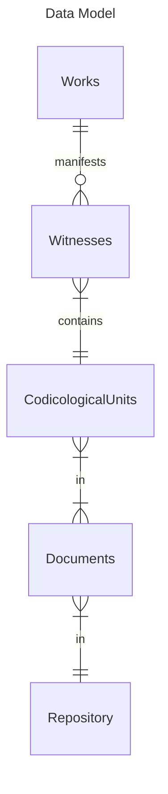

# Scrape metadata from the Handschriftencensus

## Install

Python 3.13

```
pip install .
```

## Methodology

### Ontology

> in progress

|Entity|Description|Example|Identifier|Fields|
|--|--|--|--|--|
|Work|Creative work.|https://handschriftencensus.de/werke/437|work ID, i.e. `437`|`id`, `title`, `status`, `references`|
|Witness|An item in the list of the work's transmission (_Überlieferung_).|`□ Amberg, Provinzialbibl., 8° Ms. 1` `+ Berlin, Staatsbibl., mgf 734 Nr. 8` `+ Berlin, Staatsbibl., mgf 923 Nr. 40` `+ Oberhollabrunn, Knabenseminar, ohne Sign.`|work ID + codicological unit ID, i.e. `(437, 1037)`|`work_id`, `unit_id`|
|Codicological Unit|A codicological unit.|https://handschriftencensus.de/1037|codicological unit ID, i.e. `1037`|`id`, `writing_material`, `folio_dimensions`, `written_area`, `number_of_columns`, `number_of_lines`, `verse_layout`, `date_of_creation`, `scribal_dialect`|
|Part|Locus of the witness in the the codicological unit.|`Wolfram von Eschenbach: 'Parzival' (Fragm. 24)`|TODO: CHECK _work ID + codicological unit ID, i.e. (`437`, `1037`)_|`work_id`, `unit_id`, `locus`|
|Document|Library item (can be identical with codicological unit).|https://handschriftencensus.de/hss/Berlin#s89857|document ID, i.e. `89857`|`id`, `library_alias`, `shelfmark`, `type`, `number_of_folios`|
|City|Location of the library.|https://handschriftencensus.de/hss/Berlin|name, i.e. `Berlin`|`id`,`name`, `references`|

### Data model

> in progress



### Discoverability

> in progress

Q1: Get all documents that contain work A.
```sql
SELECT wk.title, d.*
FROM Witnesses wt
INNER JOIN Works wk
    ON wt.work_id = wk.id
LEFT JOIN CodicologicalUnits cu
    ON wt.unit_id = cu.id
LEFT JOIN Documents d
    ON cu.doc_id = d.id
```

## Collect Works

```
python src/main.py works
```

### `Works` table

```console
┌───────┬──────────────────────┬─────────────┬────────────────────────────────────────────────────────────────────────────────────────────────────────────────────────────────────────────────┐
│  id   │        title         │   status    │                                                                   references                                                                   │
│ int32 │       varchar        │   varchar   │                                                                   varchar[]                                                                    │
├───────┼──────────────────────┼─────────────┼────────────────────────────────────────────────────────────────────────────────────────────────────────────────────────────────────────────────┤
│  2448 │ 'A solis ortus car…  │ surviving   │ []                                                                                                                                             │
│  2449 │ 'Aachener Chronik'   │ surviving   │ [https://portal.dnb.de/opac.htm?query=nid%3D1267444606&method=simpleSearch&cqlMode=true, https://lobid.org/gnd/1267444606, https://www.germa…  │
│   729 │ 'ABC vom Altarssak…  │ surviving   │ []
```

### Relational `Witnesses` table
```console
┌─────────┬─────────┐
│ work_id │ unit_id │
│  int32  │  int32  │
├─────────┼─────────┤
│     729 │    3516 │
│     729 │    3517 │
```